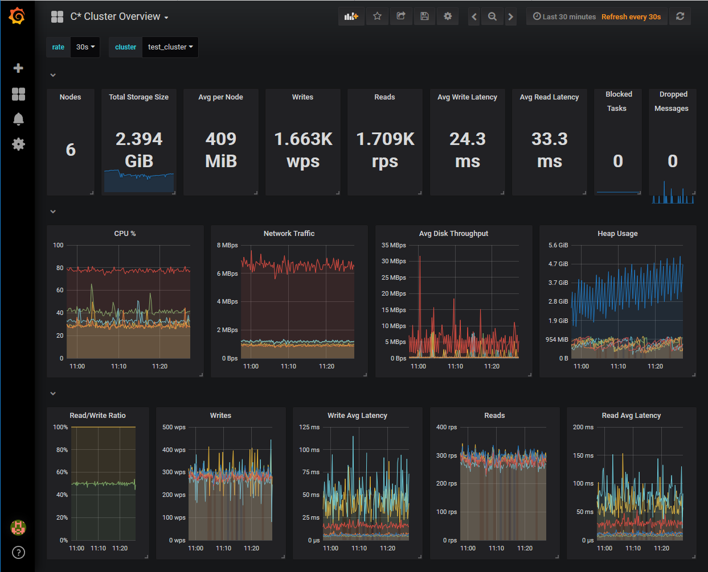
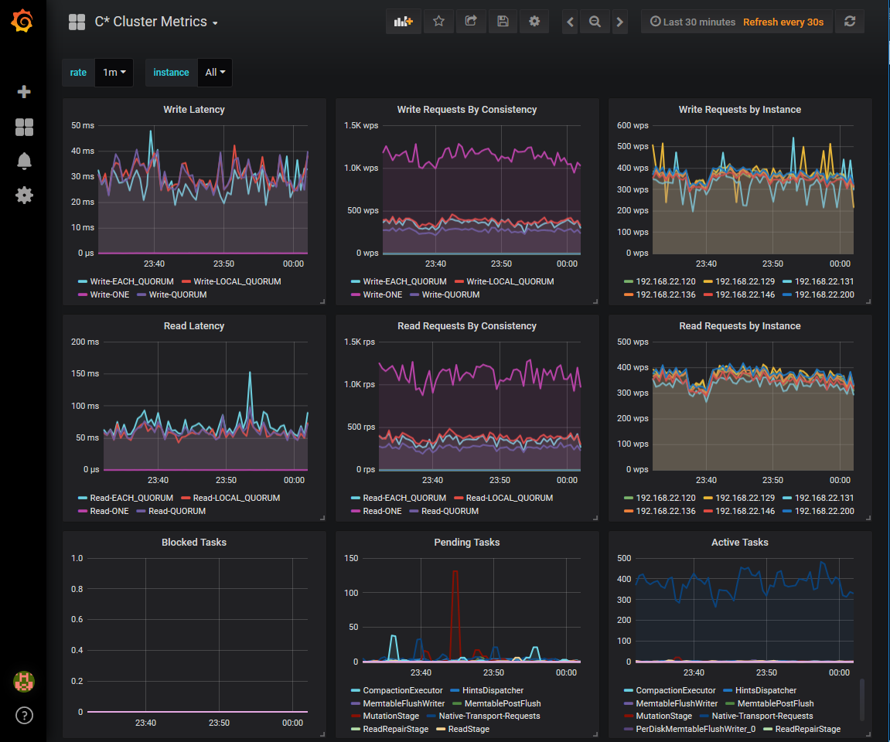
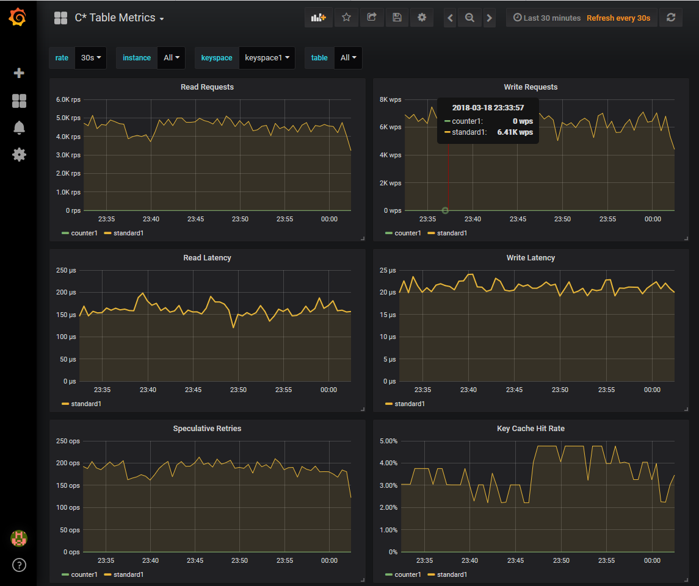
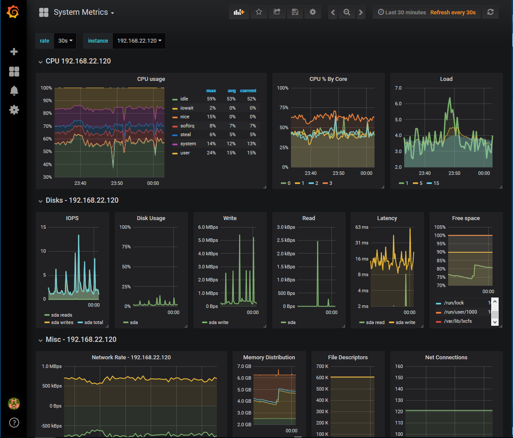

# Grafana and Prometheus Monitoring Apache Cassandra
This repo contains everthing needed to lauch docker containers with [Prometheus](https://prometheus.io/) and [Grafana](https:/grafana.com/) to monitor an Apache Cassandra cluster.
The new provisioning features of Grafana 5.x are used to configure the datasource and import the dashboards.

## Prerequisites
* [Docker Compose](https://docs.docker.com/compose/install/#install-compose)
* Apache Cassandra 3.x Cluster

Earlier versions will work but certain Grafana dashboard metrics may not load

* [JMX Prometheus Exporter setup on the Cassandra cluster nodes](https://www.robustperception.io/monitoring-cassandra-with-prometheus/)

Here's an Ansible role which can install the exporter for you on an RHEL based OS: [Cassandra JMX Exporter](https://github.com/soccerties/cassandra-misc/tree/master/ansible/roles#cassandra-exporter)

* [Node Exporter](https://github.com/prometheus/node_exporter) version 0.16.0 running on the Cassandra cluster nodes

Earlier versions will work but several metric names were changed in 0.16 and certain Grafana metrics may not load

## Usage
* Clone the repo and change directories into it
```
git clone https://github.com/soccerties/cassandra-monitoring.git
cd cassandra-monitoring
```
* Edit the json files `prometheus/tg_cassandra.json` and `prometheus/tg_node.json` and define your collection endpoints
```
[
  {
    "targets": [ 
      "192.168.22.200:7070", 
      "192.168.22.129:7070", 
      "192.168.22.131:7070", 
      "192.168.22.146:7070", 
      "192.168.22.120:7070",
      "192.168.22.136:7070" 
    ],
    "labels": {
      "cluster": "test_cluster"
    }
  }
]
```
```
[
  {
    "targets": [ 
      "192.168.22.200:9100", 
      "192.168.22.129:9100", 
      "192.168.22.131:9100", 
      "192.168.22.146:9100", 
      "192.168.22.120:9100",
      "192.168.22.136:9100" 
    ],
    "labels": {
      "cluster": "test_cluster"
    }
  }
]
```
* Edit any other parameters you'd like in the docker-compose.yaml file. Such as the Grafana admin password. Then launch the docker containers
```
docker-compose up -d
```
That's it! If there were no erros you can open a browser and visit the Grafana interface and login (http://localhost:3000/)

### Dashboards
4 Grafana dashboards are included
* C* Cluster Overview

* C* Cluster Metrics

* C* Table Metrics

* System Metrics

